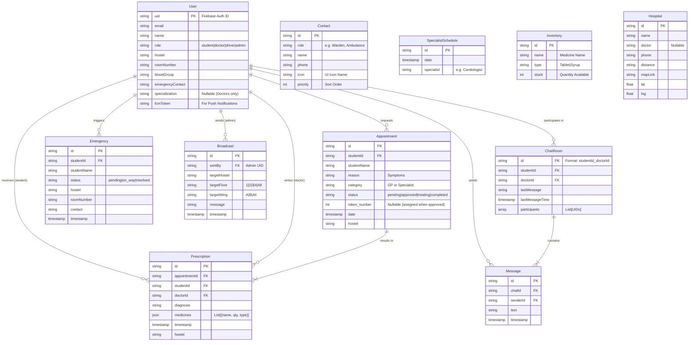

# Ixtli - *Smart Health for Smart Students*
## Table Of Content:
1. [Aim](#aim)
2. [Tech Stack](#tech-stack)
3. [Directory Structure](#directory-structure)
4. [Models](#models)
5. [Run](#run)

### Aim:

**Ixtli** (named after the Aztec god of medicine) aims to revolutionize campus healthcare by replacing reactive, inefficient systems with a **proactive, AI-driven digital ecosystem**. The platform bridges the gap between students, medical staff, and emergency services to ensure:

* **Intelligent Triage:** Reducing unnecessary clinic visits by using Generative AI (Dr. AI) to assess symptoms and route students to the correct specialist.
* **Rapid Emergency Response:** Minimizing the "Golden Hour" delay with an SOS system that instantly dispatches ambulance drivers with live patient data.
* **Predictive Health Protection:** Using the **Sentinel System** to analyze prescription data in real-time and detect disease outbreaks (e.g., Dengue clusters) before they spread.
* **Streamlined Operations:** Eliminating physical queues with a live digital token system and integrated pharmacy inventory management.

### Tech Stack:

The project leverages the **Google Ecosystem** to deliver a high-performance, cross-platform experience.

#### **Frontend (Mobile App)**

* **Framework:** [Flutter](https://flutter.dev/) (Dart) - For a beautiful, native-compiled UI on Android & iOS.
* **State Management:** [Riverpod](https://riverpod.dev/) (`hooks_riverpod`) - For robust, testable state management.
* **Navigation:** `go_router` - For deep linking and declarative routing.
* **Maps:** `flutter_map` (OpenStreetMap) & `url_launcher` - For embedded campus maps and navigation.

#### **Backend (Serverless)**

* **Database:** **Firebase Firestore** - For real-time data sync (Queues, Chat, Inventory).
* **Authentication:** **Firebase Auth** - For secure role-based login (Student, Doctor, Admin, Driver).
* **Notifications:** **Firebase Cloud Messaging (FCM)** & `flutter_local_notifications` - For critical alerts (SOS, Broadcasts).

#### **Artificial Intelligence**

* **Model:** **Google Gemini-2.5-Flash** (via `flutter_gemini`) - For natural language symptom analysis and specialist recommendation.

### Directory Structure:

```mermaid
graph LR
    %% --- Styles ---
    %% Folder: Deep Material Blue with White Text (High visibility on all backgrounds)
    classDef folder fill:#1976d2,stroke:#0d47a1,stroke-width:2px,color:#fff,rx:5px,ry:5px;
    
    %% File: Pure White with Blue-Grey Border (Clean look, distinct edges)
    classDef file fill:#ffffff,stroke:#546e7a,stroke-width:1px,color:#000,rx:3px,ry:3px;

    %% --- Root ---
    lib((lib/)):::folder
    main(main.dart):::file
    options(firebase_options.dart):::file
    lib --> main
    lib --> options

    %% --- 1. Models ---
    models(models/):::folder
    lib --> models
    models --> user_m(user_model.dart):::file
    models --> chat_m(chat_model.dart):::file

    %% --- 2. Providers ---
    providers(providers/):::folder
    lib --> providers
    providers --> auth_p(auth_provider.dart):::file
    providers --> user_p(user_provider.dart):::file
    providers --> chat_p(chat_provider.dart):::file
    providers --> doc_p(doctor_provider.dart):::file
    providers --> app_p(appointment_provider.dart):::file
    providers --> sos_p(sos_provider.dart):::file
    providers --> sent_p(sentinel_provider.dart):::file
    providers --> pharm_p(pharmacy_provider.dart):::file
    providers --> content_p(content_provider.dart):::file
    providers --> route_p(router_provider.dart):::file

    %% --- 3. Services ---
    services(services/):::folder
    lib --> services
    services --> auth_s(auth_service.dart):::file
    services --> chat_s(chat_service.dart):::file
    services --> bot_s(chatbot_service.dart):::file
    services --> doc_s(doctor_service.dart):::file
    services --> app_s(appointment_service.dart):::file
    services --> sos_s(sos_service.dart):::file
    services --> sent_s(sentinel_service.dart):::file
    services --> pharm_s(pharmacy_service.dart):::file
    services --> notif_s(notification_service.dart):::file
    services --> cont_s(content_service.dart):::file

    %% --- 4. Utils ---
    utils(utils/):::folder
    lib --> utils
    utils --> const(app_constants.dart):::file
    utils --> excep(app_exception.dart):::file

    %% --- 5. Screens (Architecture Layout) ---
    screens(screens/):::folder
    lib --> screens

    %% Admin Flow
    admin(admin/):::folder
    screens --> admin
    admin --> admin_h(admin_home.dart):::file
    admin_tabs(tabs/):::folder
    admin --> admin_tabs
    admin_tabs --> inv_t(inventory_tab.dart):::file
    admin_tabs --> man_t(manage_content_tab.dart):::file
    admin_tabs --> sen_t(sentinel_tab.dart):::file

    %% Auth Flow
    auth(auth/):::folder
    screens --> auth
    auth --> login(login_screen.dart):::file

    %% Chat Flow
    chat_ui(chat/):::folder
    screens --> chat_ui
    chat_ui --> chat_scr(chat_screen.dart):::file
    chat_ui --> chats_t(chats_tab.dart):::file

    %% Doctor Flow
    doctor(doctor/):::folder
    screens --> doctor
    doctor --> doc_h(doctor_home.dart):::file
    doctor --> consult(consultation_screen.dart):::file
    doc_tabs(tabs/):::folder
    doctor --> doc_tabs
    doc_tabs --> pend_t(pending_tab.dart):::file
    doc_tabs --> queue_t(queue_tab.dart):::file
    doc_tabs --> sched_t(schedule_tab.dart):::file

    %% Driver Flow
    driver(driver/):::folder
    screens --> driver
    driver --> driv_h(driver_home.dart):::file

    %% Student Flow
    student(student/):::folder
    screens --> student
    student --> stud_h(student_home.dart):::file
    student --> ai_s(ai_chat_screen.dart):::file
    student --> book_s(book_appointment_screen.dart):::file
    student --> hist_s(medical_history_screen.dart):::file
    student --> hosp_s(nearby_hospitals_screen.dart):::file
    student --> all_d(all_doctors_screen.dart):::file
    student --> auth_c(authorities_contact_screen.dart):::file
```

### Models:



### Run:

**Before you begin, ensure you have the following:**

* Flutter SDK (v3.0.0+)
* Android Studio (with an Emulator installed)
* Firebase Configuration Files (Required for the app to launch):
* Download google-services.json and place it in android/app/.
* (iOS only) Download GoogleService-Info.plist and place it in ios/Runner/.

#### **Setup Instructions**

* **Clone the Repository**
```bash
git clone https://github.com/Arpit-Mohapatra007/ixtli-campus-health
cd ixtli-campus-health

```


* **Option 1: Quick Start (Automated):** 

We have included automation scripts to install dependencies, configure the environment, and launch the app in one go.

**For Windows (PowerShell):**

1. Open the project folder in PowerShell.
2. Run the launch script:
```PowerShell
.\launch.ps1
```
_(If prompted, update the .env file with your Gemini API Key and run the script again)._

**For Mac / Linux (Bash):**

1. Open the terminal in the project folder.
2. Grant permission and run:
```Bash
chmod +x launch.sh
./launch.sh
```

* **Option 2: Manual Setup**

If you prefer setting it up step-by-step:
1. Install Dependencies
```Bash
flutter pub get
```
2. Configure Environment

Create a file named `.env` in the root directory and add your API key:
```Code snippet
GEMINI_API_KEY=your_actual_api_key_here
```

3. Launch Emulator

Open Android Studio and launch a virtual device.

4. Run the App
```Bash
flutter run
```

* **Demo Credentials**

**Important:** The app simulates a secure campus environment. New sign-ups are restricted to emails pre-registered in the college database (`college_registry`).

To test the app immediately, please use these Demo Accounts:

|Role|Email|Password|Features to Test|
|---|----|----|----|
|Student|rahul@college.edu|1234567890|Dr. AI Chat, Book Appointment, SOS|
|Doctor|doc.gyno@college.com|1234567890|Approve Appointments, Write Prescriptions|
|Admin|admin@college.com|1234567890|Sentinel Dashboard, Inventory, Broadcasts|
|Driver|driver@college.com|1234567890|Receive SOS Alerts, Navigation|

#### **Docker Support (Web)**

To build and deploy the web version as a container, follow these steps.

1. **Setup Environment**
The build process requires the `.env` file to be present. Create one if you haven't already:
```bash
# Linux/Mac
echo "GEMINI_API_KEY=your_api_key_here" > .env

# Windows (PowerShell)
Set-Content .env "GEMINI_API_KEY=your_api_key_here"
```
2. **Build the Image**
```bash
docker build -t ixtli_health .
```
3. **Run the Container**
```bash
docker run -d -p 8080:80 ixtli_health

```
4. Access the app at `http://localhost:8080`.
5. Cleanup (Stop & Remove)
```bash
docker stop ixtli_container
docker rm ixtli_container
```
